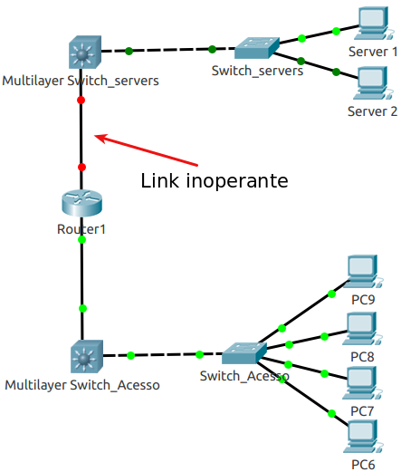

[TOC]

# Prefácio

FAZER


# Capítulo 1: Introdução ao Nagios

Nagios é uma ferramenta para monitoramento de rede/sistema, isso significa que o Nagios verifica computadores e/ou dispositivos na sua rede e garante que eles estejam funcionando como deveriam. 

O Nagios verifica constantemente se as máquinas estão funcionando corretamente (através do ping),  ele também verifica se os serviços monitorados nessas máquinas estão funcionando bem.  O principal objetivo do monitoramento da infraestrutura de TI é detectar o mais rápido possível qualquer evento que tenha acontecido, para que se possa tomar uma ação antes que os usuários desse sistema relatem o problema. O monitoramento do sistema no Nagios é dividido em duas categorias de objetos: verificação de hosts e verificação de serviços.  Os hosts representam um dispositivo físico ou virtual em sua rede (servidores, roteadores, switchs, impressoras entre outros). 

Os serviços são funcionalidades específicas, por exemplo, um servidor SSH (Secure Shell), consumo de memória, uso de HD, serviço de e-mail, entre outros serviços. Cada serviço está associado a um host no qual está sendo executado. Além disso, as máquinas podem ser agrupadas em grupos de hosts.

Para que toda essa monitoração ocorra, existem vários arquivos de configuração diferentes que você precisará criar e/ou editar antes de começar a monitorar um dispositivo.

A mágica do Nagios acontece nas verificações de desempenho, ele usa apenas quatro estados distintos, sendo eles: Ok, Warning, Critical e Unknown, tem também o fato de ser baseado em plugins, significando  que se você quiser verificar algum recurso que ainda não tenha um plugin, bastaria escrever um.

O Nagios já vem com um conjunto de plugins padrão, mas caso você tenha necesidade, pode criar seus próprios plugins.


## Principais características

O Nagios é uma ferramenta muito flexivel, ele pode ser configurado para monitorar sua infraestrutura de TI da maneira que você deseja. Também possui um mecanismo para reagir automaticamente a problemas e possui um poderoso sistema de notificação. Tudo isso é baseado em um sistema de definição de objeto, como explicado a seguir:

- **Comandos**: É a forma que o Nagios vai executar as verificações. Sendo uma parte importante da comunicação do Nagios com os plugins.

- **Períodos de tempo**: São períodos de data e hora em que uma operação deve ou não ser executada. Por exemplo, de segunda a sexta-feira, das 09:00 às 17:00.

- **Hosts e grupos de hosts**: São dispositivos, além da possibilidade de agrupar hosts. Um único host pode ser membro de mais de um grupo.

- **Serviços**: São várias funcionalidades ou recursos para monitorar em um host específico. Por exemplo, uso da CPU, espaço de armazenamento ou servidor da Web e etc.

- **Contatos e grupos de contatos**: São as pessoas que devem ser notificadas com informações sobre um evento no host ou serviço, os contatos podem ser agrupados, e um único contato pode ser membro de mais de um grupo.

- **Notificações**: Definem quem deve ser notificado sobre o que, por exemplo, todos os erros do grupo de servidores Windows devem ir para o grupo de contatos do windows-administration durante o horário de trabalho e para o grupo de contatos da equipe nível 2 fora do horário de trabalho.

- **Escalações**: São extensões de notificações; eles definem que depois que um objeto está no mesmo estado por um período específico de tempo, outras pessoas devem ser notificadas de determinados eventos, por exemplo, um servidor crítico que esteja inativo por mais de 4 horas deve alertar o gerenciamento de TI para que eles acompanhem o problema.

Para qualquer administrador, é óbvio que, se o roteador estiver inativo, todas as máquinas acessadas por ele falharão. Caso você não leve isso em consideração, e esse roteador venha a ficar indisponível, você receberá uma lista de várias máquinas e serviços com falha. O Nagios permite definir dependências entre hosts para refletir a topologia de rede real e permite relações entre dispositivos para impedir que sua caixa de mensagem fique lotada de alertas. 

Por exemplo, se um switch L3 que o conecta parte da sua rede estiver inoperante, o Nagios não executará verificações das máquinas subseqüentes (depois do roteador). Isso é ilustrado na figura a seguir:



No caso acima, um dos links está fora, mesmo que os switchs e servidores estejam funcionando, o Nagios não consegue chegar até eles, dessa forma, será retornado indisponibilidade de todos os dispositivos atrás do link com problema, se a configuração correta do Nagios for feita, receberemos apenas um alerta do switch L3, e não de todos os dispositivos atrás do switch L3.


## Estados Soft e hard

O Nagios funciona verificando se um host ou serviço específico está funcionando corretamente e armazenando seu status. Para evitar a detecção de falhas aleatórias e temporárias, o Nagios usa estados *soft* e *hard* para descrever qual é o status atual de um host ou serviço.

Imagine que um administrador esteja reiniciando um servidor da Web e essa operação torne a conexão com as páginas da Web indisponível por 5 segundos. Como essas reinicializações geralmente são feitas à noite para diminuir o número de usuários afetados, esse é um período aceitável. No entanto, um problema pode ser que o Nagios tente se conectar ao servidor e observe que ele está realmente inoperante. Se depender apenas de um único resultado, o Nagios poderá acionar um alerta de que um servidor da Web está inoperante. Na verdade, ele voltaria a funcionar em alguns segundos, mas levaria alguns minutos para Nagios descobrir isso.

Para situações onde o serviço ficou inativo por um curto periodo de tempo ou ou foi um falha momentanea, foram introduzidos estados de verificações *soft*. Quando um status é desconhecido ou é diferente de um status anterior (para o mesmo host/serviço), o Nagios testará novamente o host ou o serviço algumas vezes para garantir que a alteração seja permanente, ou seja, para garantir que o evento não tenha sido momentaneo. Assim o Nagios assume que o novo resultado é um estado *soft*. Após alguns testes *softs*, se o evento continuar acusando o mesmo status, isso significa que o novo estado é permanente (está mesmo com algum problema), então ele é considerado um estado *hard*.

Cada verificação de host e serviço define o número de tentativas a serem executadas antes de assumir que uma alteração é permanente. Isso permite mais flexibilidade sobre quantas falhas devem ser tratadas como um problema real em vez de temporário. Definir o número de verificações como 1 fará com que todas as alterações sejam tratadas como um problema real (isso pode causar falsos alertas). 


# Capítulo 2: Instalando o Nagios 4

Todo processo de instalação foi realizado seguindo a [documentação oficial](https://support.nagios.com/kb/article/nagios-core-installing-nagios-core-from-source-96.html#Ubuntu) do Nagios, usando o sistema operacional do Ubuntu 18.08 LTS.

- Links

  [Nagios Core - Installing Nagios Core From Source](https://support.nagios.com/kb/article/nagios-core-installing-nagios-core-from-source-96.html)

  [Table of Contents](https://assets.nagios.com/downloads/nagioscore/docs/nagioscore/4/en/toc.html)


## Preparando o ambiente


Inicialmente vamos baixar alguns pacotes que vamos usar durante a utilização do servidor.

Segue o comando usado:

```
sudo apt-get install -y unzip zip tcpdump openssh-server mtr nmap perl python python3 vim curl htop wget bc gawk snmp snmpd libnet-snmp-perl

# Descrição das aplicações que vão ser instaladas:

	# UNZIP = Desarquivador para arquivos .zip;
	# ZIP = Arquivador para arquivos .zip;
	# TCPDUMP = Analizador de tráfego de Rede;
	# openssh-server = Servidor SSH (Secure Shell), para acesso seguro a partir de máquinas remotas;
	# MTR = Ferramenta traceroute de tela cheia em ncurses e X11;
	# NMAP = Mapeador de Rede (fazer verificação de portas;
	# PERL = Linguagem de extração e relatórios prática de Larry Wall;
	# PYTHON = Linguagem interativa de alto nível orientada a objetos (versão 2 - padrão);
	# PYTHON3 = Linguagem interativa de alto nível orientada a objetos (versão 3 - padrão);
	# VIM = Editor VI melhorado;
	# CURL = Ferramenta de linha de comando para transferir dados com sintaxe de URL;
	# HTOP = Visualizador de processos interativo;
	# WGET = Gerenciador de download;
	# BC = Calculadora de linha de comando;
	# GAWK = Linguagem AWK;
	# SNMP = Aplicação cliente para utilizar o protocolo SNMP (Gerenciamento de redes);
	# SNMPD = Aplicação servidor para utilizar o protocolo SNMP (Gerenciamento de redes);
	# LIBNET-SNMP-PERL = Script de conexões SNMP.
```

## 

## Pré requisitos

Para podermos compilar o Nagios precisamos atender aos pré  requisitos, caso contrário, teremos erro durante a compilação, abaixo  segue o comando que instala as dependências do Nagios.

```
sudo apt-get install -y autoconf gcc libc6 php7.2 php make libapache2-mod-php7.2 apache2 build-essential xinetd 

# Descrição das aplicações que vão ser instaladas:
	# Pré requisitos informados na documentação do Nagios
		# AUTOCONF = Construtor automático de script configure (necessário para compilar);
		# GCC = Compilador C;
		# LIBC6 = Biblioteca C: Bibliotecas compartilhadas;
		# PHP = Linguagem de script incorporada em HTML do servidor (padrão);
		# MAKE = Utilitário de compilação;
		# LIBAPACHE2-MOD-PHP = linguagem de script incorporada em HTML do servidor (módulo Apache 2) (padrão);
		# APACHE = Servidor Web;
		# LIBGD-DEV = Biblioteca de gráficos GD (versão de desenvolvimento).
		
	# Outras aplicações de desenvolvimento
		# XINETD = substituto para o inetd com muitas melhorias.
		# BUILD-ESSENTIALS = O pacote build-essential é uma referência para todos os pacotes necessários para compilar um pacote Debian. Geralmente inclui os compiladores e bibliotecas GCC / g ++ e alguns outros utilitários;
```

## 

## Baixando o Nagios Core

Agora vamos baixar o pacote do Nagios para podermos compilá-lo.

```
# Entra na pasta /tmp:
cd /tmp

# Baixa o pacote do Nagios Core renomeando o arquivo baixado para nagioscore.tar.gz:
wget -O nagioscore.tar.gz https://github.com/NagiosEnterprises/nagioscore/archive/nagios-4.4.5.tar.gz

# Descompactar o nagioscore.tar.gz:
tar xzvf nagioscore.tar.gz

# Entrar no nagioscore-nagios-4.4.5:
cd nagioscore-nagios-4.4.5
```


### Compilar o nagios core

```
# Vamos iniciar a preparação do ambiente para podermos compilar o pacote, passamos como argumento o arquivo de configuração do Nagios para o Apache, onde irá ficar o arquivo de apontamento do Nagios para que possamos acessá-lo pelo navegador:
sudo ./configure --with-httpd-conf=/etc/apache2/sites-enabled

# Vamos criar os binários para instalação futura:
sudo make all

# Vamos criar o usuário e grupos do nagios (o grupo deve ser nagcmd, mas o comando abaixo cria o usuário NAGIOS e grupo NAGIOS).
	# O comando 'make install-groups-users' irá criar uma conta do sistema e adicionar esse usuário no grupo do nagios:
	sudo make install-groups-users

# Adicionando o usuário www-data no grupo nagios como um grupo secundário:
sudo usermod -a -G nagios www-data

# Instalando os binários, CGIs e arquivos HTML gerados pelo 'make all':
sudo make install

# Instalando os arquivos de serviço/daemon e habilitando o serviço para iniciar no boot:
sudo make install-daemoninit

# Instalar o arquivo para termos comando externo no Nagios:
sudo make install-commandmode

# Instalando os arquivos de configuração SAMPLE, isso é necessário, pois, sem isso, o Nagios não irá iniciar, ele instala tudo que está dentro de '/usr/local/nagios/etc':
sudo make install-config

# Instalando os arquivos de configuração do servidor web Apache e definindo as configurações do Apache:
	# Instalando o arquivo de configuração do Apache para a interface da web do Nagios (/etc/apache2/sites-enabled/nagios.conf):
	sudo make install-webconf
		
	# Ativando a reescrita do módulo:
	sudo a2enmod rewrite
	
	# Ativando o módulo CGI:
	sudo a2enmod cgi

# Liberando o apache no firewall do Ubuntu:
sudo ufw allow Apache

# Recarregando as regras do firewall:
sudo ufw reload
```

[Explicação rewrite](https://httpd.apache.org/docs/current/mod/mod_rewrite.html).

[Explicação CGI](https://en.wikibooks.org/wiki/Apache/CGI).


#### Criando uma conta de usuário no Nagios

Agora vamos criar um usuário que poderá acessar a aplicação web do Nagios.

```
# Criando um usuário chamado 'nagiosadmin'
sudo htpasswd -c /usr/local/nagios/etc/htpasswd.users nagiosadmin

# Mudando Dono e Grupo dono do arquivo 'htpasswd.users':
sudo chown nagios. /usr/local/nagios/etc/htpasswd.users
```


#### Manipuladores de eventos do Nagios

Vamos copiar a pasta de notificação de eventos do Nagios para pasta de produção.

```
# Copiando a pasta 'eventhandlers' para '/usr/local/nagios/libexec/':
sudo cp -R contrib/eventhandlers/ /usr/local/nagios/libexec/

# Mudando usuário e dono da pasta 'eventhandlers':
sudo chown -R nagios:nagios /usr/local/nagios/libexec/eventhandlers
```


#### Reiniciando o Nagios/Apache

Vamos reiniciar o apache e o Nagios para "aplicar" as mudanças.

```
# Reiniciando o Apache2:
sudo systemctl restart apache2.service

# Reiniciando o Nagios:
sudo systemctl start nagios.service
```

Agora precisamos acessar o IP do servidor do Nagios para verificar se conseguimos acessar a aplicação web do Nagios, o usuário é **nagiosadmin**, a senha é a senha que você definiu.

Se você esqueceu a senha, pode adicionar o usuário novamente usando o comando abaixo e digitar uma nova senha.

```
sudo htpasswd -c /usr/local/nagios/etc/htpasswd.users nagiosadmin
```

Caso tenha conseguido acessar, você vera que todos os checks para o  localhost (servidor Nagios) estarão vermelhos, como na imagem abaixo:

[](https://github.com/BRVN01/NAGIOS/blob/master/IMG/1573130380552.png)

Isso se deve ao motivo de não termos os plugins necessários para a  verificação desses serviços, podemos ver isso clicando em alguns dos  serviços que estão sendo verificados (vamos pegar como exemplo o Current Load), podemos verificar no campo **Status Information** que o erro é devido ao arquivo (plugin) não ter sido encontrado.

[](https://github.com/BRVN01/NAGIOS/blob/master/IMG/1573130571787.png)

Para corrigir isso, vamos instalar os plugins padrões do Nagios.


# Capítulo 3: Instalando o Nagios Plugins

Vamos instalar os plugins padrões do Nagios para que possamos ter uma monitoração padrão da ferramenta.

 

## Pré requisitos

Boa parte dos pré requisitos do Nagios-Plugins já foi instalado  anteriormente, vamos instalar apenas os que não foram instalados.

```
sudo apt install -y libmcrypt-dev libssl-dev dc gettext libmcrypt4

# libmcrypt-dev = Arquivos de desenvolvimento da biblioteca de decriptografia/criptografia;
# libssl-dev = Kit de ferramentas Secure Sockets Layer - arquivos de desenvolvimento;
# dc = calculadora de precisão arbitrária polonesa-reversa dc GNU;
# gettext = Utilitários de internacionalização GNU;
# libmcrypt4 = Biblioteca de Des/Encriptação
```


## Compilando os plugins

Agora vamos baixar e compilar o pacote de plugins do Nagios.

```
# Entrando no /tmp:
cd /tmp

# Baixando o pacote do Nagios-Plugins:
wget --no-check-certificate -O nagios-plugins.tar.gz https://github.com/nagios-plugins/nagios-plugins/archive/release-2.2.1.tar.gz

# Descompactando o pacote baixado:
tar zxf nagios-plugins.tar.gz

# Entrando na pasta descompactada do Nagios-Plugins:
cd /tmp/nagios-plugins-release-2.2.1/

# Instala alguns scripts para auxiliar na compilação:
sudo ./tools/setup

# Preparando o ambiente para a compilação:
sudo ./configure

# Vamos criar os binários para instalação futura:
sudo make

# Instalando os binários, CGIs e arquivos HTML gerados pelo 'make all':
sudo make install

# Mundando o usuário e grupo dos plugins para o Nagios:
chown nagios. /usr/local/nagios/libexec/*
```


## Reiniciando o daemon do Nagios

```
# Reinicia o daemon do Nagios:
sudo systemctl restart nagios.service

# Mostra o estatus do serviço do Nagios:
sudo systemctl status nagios.service
```


Você pode verificar o arquivo de configuração do Nagios usando o comando `/usr/local/nagios/bin/nagios -v /usr/local/nagios/etc/nagios.cfg`.

Após isso você pode dar um `Re-schedule the next check of this service` nos serviços, até que eles venham a ficar com status OK, como na imagem abaixo:

[](https://github.com/BRVN01/NAGIOS/blob/master/IMG/1573143150490.png)


Aplicando o `Re-schedule the next check of this service` nos serviços: [](https://github.com/BRVN01/NAGIOS/blob/master/IMG/1573143273027.png) 


# Capítulo 4: Configurando o Nagios

Nessa sesção vamos configurar manualmente o arquivo de configurações do Nagios para que possamos ter um arquivo mais customizado.


## Criando o arquivo de configuração principal

O arquivo de configuração principal é chamado nagios.cfg e é o arquivo principal carregado durante a inicialização do Nagios. Ele contém várias diretivas que afetam como o daemon do Nagios Core opera. Este arquivo de configuração é lido pelo daemon do Nagios Core e pelos CGIs.

Para acessar o link que leva a documentação oficial do arquivo de configuração principal do Nagios, basta clicar [aqui](https://assets.nagios.com/downloads/nagioscore/docs/nagioscore/4/en/configmain.html) .

O arquivo nagios.cfg fica localizado no diretório /usr/local/nagios/etc/nagios.cfg, segue um exemplo:

``` bash
# Arquivo de log, 
# isso requer: 'mkdir /var/log/nagios/' e 'chown -R nagios. /var/log/nagios/' para LOG_FILE
log_file=/var/log/nagios/nagios.log
log_rotation_method=d
log_archive_path=/usr/local/nagios/var/archives
use_syslog=1
log_notifications=1
log_service_retries=1
log_host_retries=1
log_event_handlers=1
log_current_states=1
log_external_commands=1
log_passive_checks=0

# Diretório de configuração dos objetos
cfg_file=/usr/local/nagios/etc/objects/commands.cfg
cfg_file=/usr/local/nagios/etc/objects/contacts.cfg
cfg_file=/usr/local/nagios/etc/objects/timeperiods.cfg
cfg_file=/usr/local/nagios/etc/objects/templates.cfg
cfg_file=/usr/local/nagios/etc/objects/localhost.cfg
precached_object_file=/usr/local/nagios/var/objects.precache
object_cache_file=/usr/local/nagios/var/objects.cache

# Informações de armazenamento
resource_file=/usr/local/nagios/etc/resource.cfg

# Usuário e grupo Nagios
nagios_user=nagios
nagios_group=nagios

# Habilitando comandos externos (Re-schedule na interface do Nagios) 
check_external_commands=1

# Este é o arquivo que o Nagios verificará se há comandos externos para processar.
command_file=/usr/local/nagios/var/rw/nagios.cmd

# Arquivo que irá conter o PID do Nagios.
lock_file=/run/nagios.lock

# Arquivo(s) temporário(s).
temp_file=/usr/local/nagios/var/nagios.tmp
temp_path=/tmp

# Intervalo de verificações de host e serviço.
service_inter_check_delay_method=s
host_inter_check_delay_method=s

# Distribuição máxima da verificação de serviço (em minutos).
max_service_check_spread=3

# Fator de intercalação de serviço
service_interleave_factor=s

# Verificações máximas de serviço simultâneo
max_concurrent_checks=0

```

Abaixo segue uma descrição de cada variável usada no arquivo principal:

- **CFG_LOG **
  Especifica onde o Nagios deve criar seu arquivo de log principal. Essa deve ser a primeira variável que você define no seu arquivo de configuração, pois o Nagios tentará gravar neste arquivo os erros que - encontrar nos demais dados de configuração.

- **LOG_ROTATION_METHOD **
  É de quanto em quanto tempo o arquivo de log será sobrescrito (d= todo dia).

- **LOG_ARCHIVE_PATH **
  Diretório onde ficará os logs que foram rotacionados.

- **USE_SYSLOG **
  Determina se as mensagem vão ser registradas no SysLog (1 = SIM).

- **LOG_NOTIFICATIONS **
  Informa se as mensagens de notificação serão registradas (1 = sim).

- **LOG_SERVICE_RETRIES **
  Informa se as verificações 'softs' serão registradas para os serviços (1 = sim) .

- **LOG_HOST_RETRIES **
  Informa se as verificações 'softs' serão registradas para os hosts (1 = sim) .

- **LOG_EVENT_HANDLERS **
  Determina se os manipuladores de eventos de serviço e host serão ou não registrados. Manipuladores de eventos são comandos opcionais que podem ser executados sempre que um serviço ou host muda de estado.

- **LOG_CURRENT_STATES **
  Faz com que o Nagios grave o estado atual dos dispositivos gerenciados após rotacionar um log.

- **LOG_EXTERNAL_COMMANDS **
  Registra ou não comandos externos (através da CGI).

- **LOG_PASSIVE_CHECKS**
  Após aplicar um comando externo, o check passivo irá registrar em log essa ação, só que, o Nagios não pode verificar checks passivos, isso porque esses checks são feitos por outros NMSs, o Nagios apenas recebe um informação do estado do check, portanto, não é interessante usar essa opção de registro, isso só encheria mais nosso arquivo de log sem necessidade (1 = padrão, 0 = desabilitado).

- **CFG_FILE**
  É usada para especificar um arquivo de configuração de objeto contendo definições de objeto que o Nagios deve usar para monitorar. Os arquivos de configuração de objeto contêm definições para hosts, grupos de hosts, contatos, grupos de contatos, serviços, comandos etc.

- **OBJECT_CACHE_FILE**
  Especifica um arquivo no qual uma cópia em cache das definições de objetos deve ser armazenada. O arquivo de cache é (re) criado toda vez que o Nagios é (re) iniciado e é usado pelos CGIs. 
  O objetivo é acelerar o cache do arquivo de configuração nos CGIs e permitir que você edite os arquivos de configuração do objeto de origem enquanto o Nagios estiver em execução sem afetar a saída exibida nos CGIs. 
  No Nagios Core 4, configurar o caminho do arquivo object_cache_file como '/dev/null' fará com que o Nagios Core não armazene em cache as informações do objeto. Isso pode ser feito para acelerar as operações, mas não deve ser feito se os CGIs forem usados.

- **PRECACHED_OBJECT_FILE **
  Especifica um arquivo no qual uma cópia pré-processada e pré-armazenada em cache das definições de objetos deve ser armazenada. Este arquivo pode ser usado para melhorar drasticamente os tempos de inicialização em instalações Nagios grandes/complexas.

- **RESOURCE_FILE **
  É usado para especificar um arquivo de recurso opcional, que pode conter variáveis que serão reconhecidas apenas pelo Nagios ($USERn$). 
  As variáveis '$USERn$' são úteis para armazenar nomes de usuário, senhas e itens comumente usados em definições de comando (como caminhos de diretório). 
  Os CGIs não tentam ler os arquivos de recursos, portanto, você pode definir permissões restritivas (600 ou 660) para proteger informações confidenciais.

- **STATUS_FILE **
  É o arquivo que o Nagios usa para armazenar as informações atuais de status, comentários e tempo de inatividade. Esse arquivo é usado pelos CGIs para que o status atual do monitoramento possa ser relatado por meio de uma interface da web. 
  Os CGIs devem ter acesso de leitura a esse arquivo para funcionar corretamente. Este arquivo é excluído toda vez que o Nagios para e é recriado quando é iniciado. 
  No Nagios Core 4, definir o caminho do status_flie como '/dev/null' fará com que o Nagios Core não armazene informações de status. Isso pode ser feito para acelerar as operações, mas não deve ser feito se os CGIs forem usados.

- **NAGIOS USER e GROUP** 
  Especifica o usuário e grupo que o Nagios vai utilizar após ser inicializado.

- **TEMP_FILE **
  Arquivo temporário que o Nagios cria periodicamente para usar na atualização de dados de comentários, status, etc. O arquivo é excluído quando não é mais necessário.

- **TEMP_PATH **
  É um diretório que o Nagios pode usar como espaço temporário para criar arquivos temporários usados durante o processo de monitoramento.

- **SERVICE_INTER_CHECK_DELAY_METHOD** e **HOST_INTER_CHECK_DELAY_METHOD**
  Quando o Nagios é reiniciado, ele tenta agendar a verificações iniciais de todos os objetos, de uma maneira que minimize a carga imposta aos hosts locais e remotos. Isso é feito espaçando as verificações iniciais e intercalando-as. O espaçamento das verificações (também conhecido como atraso entre verificações) é usado para minimizar/equalizar a carga no host local (servidor do Nagios) e a intercalação é usada para minimizar/equalizar a carga imposta aos hosts remotos. 

  s = Use um cálculo de atraso "inteligente" para espalhar as verificações de serviço uniformemente (padrão).

- **MAX_SERVICE_CHECK_SPREAD**
  Assim que o Nagios for iniciado, ele tem um certo tempo para garantir que as verificações iniciais de todos os serviços ocorram dentro do prazo especificado, como é somente após a inicialização do Nagios, você tem que medir o tempo baseando no total de serviços ativos.

- **SERVICE_INTERLEAVE_FACTOR**
  Essa variável determina como as verificações de serviço são intercaladas. A intercalação permite uma distribuição mais uniforme das verificações de serviço, carga reduzida em hosts remotos e detecção geral mais rápida de problemas do host. Definir esse valor como 1 é equivalente a não intercalar as verificações de serviço. Defina esse valor como s (inteligente) para o cálculo automático do fator de intercalação, a menos que você tenha um motivo específico para alterá-lo. A melhor maneira de entender como a intercalação funciona é observar o status CGI (visão detalhada) quando o Nagios está apenas começando. Você deve ver que os resultados da verificação de serviço são espalhados quando começam a aparecer.

- **MAX_CONCURRENT_CHECKS**
  Esta opção permite especificar o número máximo de verificações de serviço que podem ser executadas em paralelo a qualquer momento. A especificação de um valor 0 (padrão) não impõe restrições ao número de verificações simultâneas. Você precisará modificar esse valor com base nos recursos do sistema disponíveis na máquina que executa o Nagios, pois afeta diretamente a carga máxima que será imposta ao sistema (utilização do processador, memória, etc.).

#### Arquivo (s) de Recursos

Os arquivos de recursos podem ser usados para armazenar macros definidas pelo usuário. O ponto principal de ter arquivos de recursos é usá-los para armazenar informações confidenciais de configuração (como senhas), sem disponibilizá-las aos CGIs.

Você pode especificar um ou mais arquivos de recursos opcionais usando a diretiva [resource_file](https://assets.nagios.com/downloads/nagioscore/docs/nagioscore/4/en/configmain.html#resource_file) no seu arquivo de configuração principal. 


#### Arquivos de definição de objeto

Os arquivos de definição de objeto são usados para definir hosts, serviços, grupos de hosts, contatos, grupos de contatos, comandos etc. É aqui que você define todas as coisas que deseja monitorar e como deseja monitorá-las.

Você pode especificar um ou mais arquivos de definição de objeto usando as [diretivas cfg_file](https://assets.nagios.com/downloads/nagioscore/docs/nagioscore/4/en/configmain.html#cfg_file) e / ou [cfg_dir](https://assets.nagios.com/downloads/nagioscore/docs/nagioscore/4/en/configmain.html#cfg_dir) em seu arquivo de configuração principal.

Uma introdução às definições de objetos e como elas se relacionam entre si pode ser encontrada [aqui](https://assets.nagios.com/downloads/nagioscore/docs/nagioscore/4/en/configobject.html) .

#### Arquivo de configuração CGI

O arquivo de configuração CGI contém várias diretivas que afetam a operação dos [CGIs](https://assets.nagios.com/downloads/nagioscore/docs/nagioscore/4/en/cgis.html) . Ele também contém uma referência ao arquivo de configuração principal, para que os CGIs saibam como você configurou o Nagios e onde suas definições de objetos são armazenadas.

A documentação para o arquivo de configuração CGI pode ser encontrada [aqui](https://assets.nagios.com/downloads/nagioscore/docs/nagioscore/4/en/configcgi.html) .


check_result_reaper_frequency=10
max_check_result_reaper_time=30
check_result_path=/usr/local/nagios/var/spool/checkresults
max_check_result_file_age=3600
cached_host_check_horizon=15
cached_service_check_horizon=15
enable_predictive_host_dependency_checks=1
enable_predictive_service_dependency_checks=1
soft_state_dependencies=0
auto_reschedule_checks=0
auto_rescheduling_interval=30
auto_rescheduling_window=180
service_check_timeout=60
host_check_timeout=30
event_handler_timeout=30
notification_timeout=30
ocsp_timeout=5
ochp_timeout=5
perfdata_timeout=5
retain_state_information=1
state_retention_file=/usr/local/nagios/var/retention.dat
retention_update_interval=60
use_retained_program_state=1
use_retained_scheduling_info=1
retained_host_attribute_mask=0
retained_service_attribute_mask=0
retained_process_host_attribute_mask=0
retained_process_service_attribute_mask=0
retained_contact_host_attribute_mask=0
retained_contact_service_attribute_mask=0
interval_length=60
check_for_updates=1
bare_update_check=0
use_aggressive_host_checking=0
execute_service_checks=1
accept_passive_service_checks=1
execute_host_checks=1
accept_passive_host_checks=1
enable_notifications=1
enable_event_handlers=1
process_performance_data=0
obsess_over_services=0
obsess_over_hosts=0
translate_passive_host_checks=0
passive_host_checks_are_soft=0
check_for_orphaned_services=1
check_for_orphaned_hosts=1
check_service_freshness=1
service_freshness_check_interval=60
service_check_timeout_state=c
check_host_freshness=0
host_freshness_check_interval=60
additional_freshness_latency=15
enable_flap_detection=1
low_service_flap_threshold=5.0
high_service_flap_threshold=20.0
low_host_flap_threshold=5.0
high_host_flap_threshold=20.0
date_format=us
illegal_object_name_chars=`~!$%^&*|'"<>?,()=
illegal_macro_output_chars=`~$&|'"<>
use_regexp_matching=0
use_true_regexp_matching=0
admin_email=nagios@localhost
admin_pager=pagenagios@localhost
daemon_dumps_core=0
use_large_installation_tweaks=0
enable_environment_macros=0
debug_level=0
debug_verbosity=1
debug_file=/usr/local/nagios/var/nagios.debug
max_debug_file_size=1000000
allow_empty_hostgroup_assignment=0