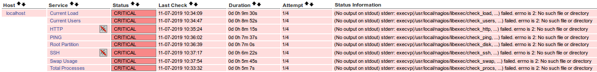
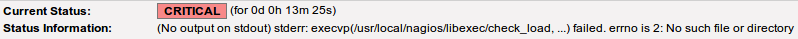
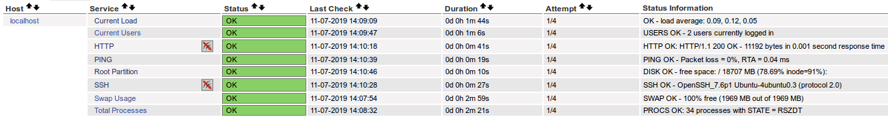
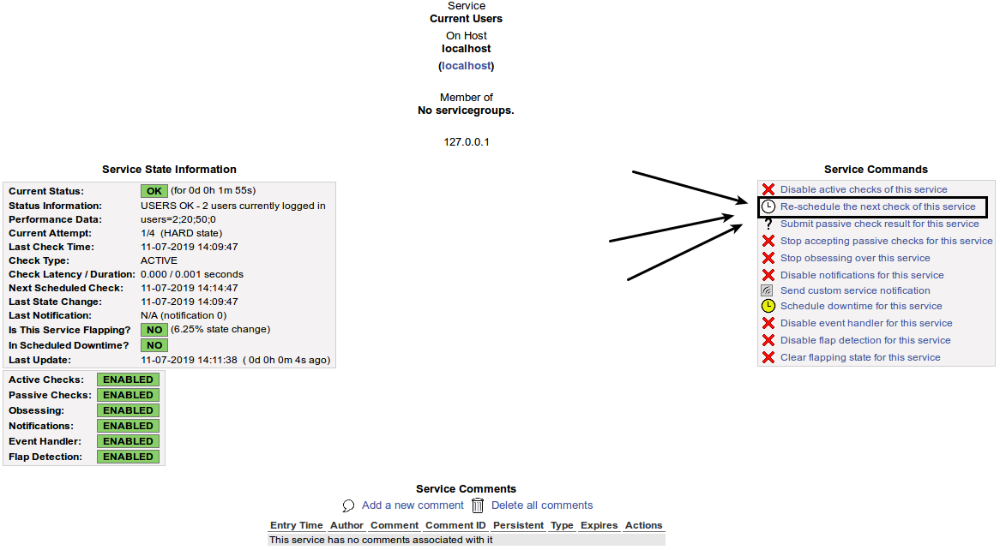

# Introdução

Este tutorial aborda o processo de instalação do Nagios Core e Nagios plugins no Ubuntu 18.04. O Nagios é um sistema de monitoramento que permite os administradores de rede e pessoal do NOC identificar e resolver problemas de infraestrutura de TI antes que eles afetem processos críticos da empresa. 

O Nagios é oficialmente patrocinado pela [Nagios Enterprises](https://www.nagios.com/), ele tem a função de monitorar toda a sua infraestrutura de TI para garantir que sistemas, aplicativos, serviços e processos de negócios estejam funcionando corretamente. Em caso de falha, o Nagios irá alertar a equipe responsável sobre o evento ocorrido para que eles possam atuar e corrigir o problema antes que isso venha impactar os processos de negócio.

O Nagios possui algumas formas de alerta após ser detectado uma mudança de estado de um dispositivo gerenciado, o tipo mais comum é o alerta visual no dashboard do Nagios, mas você pode configurar para que seja enviado e-mail e até mesmo integrar o envio de mensagens no telegram usando Nagios.

Todo processo de instalação foi realizado seguindo a [documentação oficial](https://support.nagios.com/kb/article/nagios-core-installing-nagios-core-from-source-96.html#Ubuntu) do Nagios.


- Links

  [Nagios Core - Installing Nagios Core From Source](https://support.nagios.com/kb/article/nagios-core-installing-nagios-core-from-source-96.html)

  [Table of Contents](https://assets.nagios.com/downloads/nagioscore/docs/nagioscore/4/en/toc.html)


## <span style="color:#d86c00">**Preparando o ambiente**</span>

Inicialmente vamos baixar alguns pacotes que vamos usar durante a utilização do servidor.


Segue o comando usado:

```bash
sudo apt-get install -y unzip zip tcpdump openssh-server mtr nmap perl python python3 vim curl htop wget bc gawk snmp snmpd libnet-snmp-perl

# Descrição das aplicações que vão ser instaladas:

	# UNZIP = Desarquivador para arquivos .zip;
	# ZIP = Arquivador para arquivos .zip;
	# TCPDUMP = Analizador de tráfego de Rede;
	# openssh-server = Servidor SSH (Secure Shell), para acesso seguro a partir de máquinas remotas;
	# MTR = Ferramenta traceroute de tela cheia em ncurses e X11;
	# NMAP = Mapeador de Rede (fazer verificação de portas;
	# PERL = Linguagem de extração e relatórios prática de Larry Wall;
	# PYTHON = Linguagem interativa de alto nível orientada a objetos (versão 2 - padrão);
	# PYTHON3 = Linguagem interativa de alto nível orientada a objetos (versão 3 - padrão);
	# VIM = Editor VI melhorado;
	# CURL = Ferramenta de linha de comando para transferir dados com sintaxe de URL;
	# HTOP = Visualizador de processos interativo;
	# WGET = Gerenciador de download;
	# BC = Calculadora de linha de comando;
	# GAWK = Linguagem AWK;
	# SNMP = Aplicação cliente para utilizar o protocolo SNMP (Gerenciamento de redes);
	# SNMPD = Aplicação servidor para utilizar o protocolo SNMP (Gerenciamento de redes);
	# LIBNET-SNMP-PERL = Script de conexões SNMP.
```


## <span style="color:#d86c00">**Pré requisitos**</span>

Para podermos compilar o Nagios precisamos atender aos pré requisitos, caso contrário, teremos erro durante a compilação, abaixo segue o comando que instala as dependências do Nagios.

```bash
sudo apt-get install -y autoconf gcc libc6 php7.2 php make libapache2-mod-php7.2 apache2 build-essential xinetd 

# Descrição das aplicações que vão ser instaladas:
	# Pré requisitos informados na documentação do Nagios
		# AUTOCONF = Construtor automático de script configure (necessário para compilar);
		# GCC = Compilador C;
		# LIBC6 = Biblioteca C: Bibliotecas compartilhadas;
		# PHP = Linguagem de script incorporada em HTML do servidor (padrão);
		# MAKE = Utilitário de compilação;
		# LIBAPACHE2-MOD-PHP = linguagem de script incorporada em HTML do servidor (módulo Apache 2) (padrão);
		# APACHE = Servidor Web;
		# LIBGD-DEV = Biblioteca de gráficos GD (versão de desenvolvimento).
		
	# Outras aplicações de desenvolvimento
		# XINETD = substituto para o inetd com muitas melhorias.
		# BUILD-ESSENTIALS = O pacote build-essential é uma referência para todos os pacotes necessários para compilar um pacote Debian. Geralmente inclui os compiladores e bibliotecas GCC / g ++ e alguns outros utilitários;
```


## <span style="color:#d86c00">**Baixando o Nagios Core**</span>

Agora vamos baixar o pacote do Nagios para podermos compilá-lo.

```bash
# Entra na pasta /tmp:
cd /tmp

# Baixa o pacote do Nagios Core renomeando o arquivo baixado para nagioscore.tar.gz:
wget -O nagioscore.tar.gz https://github.com/NagiosEnterprises/nagioscore/archive/nagios-4.4.5.tar.gz

# Descompactar o nagioscore.tar.gz:
tar xzvf nagioscore.tar.gz

# Entrar no nagioscore-nagios-4.4.5:
cd nagioscore-nagios-4.4.5
```


### <span style="color:#d86c00">**Compilar o nagios core**</span>

```bash
# Vamos iniciar a preparação do ambiente para podermos compilar o pacote, passamos como argumento o arquivo de configuração do Nagios para o Apache, onde irá ficar o arquivo de apontamento do Nagios para que possamos acessá-lo pelo navegador:
sudo ./configure --with-httpd-conf=/etc/apache2/sites-enabled

# Vamos criar os binários para instalação futura:
sudo make all

# Vamos criar o usuário e grupos do nagios (o grupo deve ser nagcmd).
	# O comando 'make install-groups-users' irá criar uma conta do sistema e adicionar esse 	usuário no grupo do nagios:
	sudo make install-groups-users

# Adicionando o usuário www-data no grupo nagios como um grupo secundário:
sudo usermod -a -G nagios www-data

# Instalando os binários, CGIs e arquivos HTML gerados pelo 'make all':
sudo make install

# Instalando os arquivos de serviço/daemon e habilitando o serviço para iniciar no boot:
sudo make install-daemoninit

# Instalar o arquivo para termos comando externo no Nagios:
sudo make install-commandmode

# Instalando os arquivos de configuração SAMPLE, isso é necessário, pois, sem isso, o Nagios não irá iniciar, ele instala tudo que está dentro de '/usr/local/nagios/etc':
sudo make install-config

# Instalando os arquivos de configuração do servidor web Apache e definindo as configurações do Apache:
	# Instalando o arquivo de configuração do Apache para a interface da web do Nagios (/etc/apache2/sites-enabled/nagios.conf):
	sudo make install-webconf
		
	# Ativando a reescrita do módulo:
	sudo a2enmod rewrite
	
	# Ativando o módulo CGI:
	sudo a2enmod cgi

# Liberando o apache no firewall do Ubuntu:
sudo ufw allow Apache

# Recarregando as regras do firewall:
sudo ufw reload
```

[Explicação rewrite](https://httpd.apache.org/docs/current/mod/mod_rewrite.html).

[Explicação CGI](https://en.wikibooks.org/wiki/Apache/CGI).


### <span style="color:#d86c00">**Criando uma conta de usuário no Nagios**</span>

Agora vamos criar um usuário que poderá acessar a aplicação web do Nagios.

```bash
# Criando um usuário chamado 'nagiosadmin'
sudo htpasswd -c /usr/local/nagios/etc/htpasswd.users nagiosadmin

# Mudando Dono e Grupo dono do arquivo 'htpasswd.users':
sudo chown nagios. /usr/local/nagios/etc/htpasswd.users
```


### <span style="color:#d86c00">**Manipuladores de eventos do Nagios**</span>

Vamos copiar a pasta de notificação de eventos do Nagios para pasta de produção.

```bash
# Copiando a pasta 'eventhandlers' para '/usr/local/nagios/libexec/':
sudo cp -R contrib/eventhandlers/ /usr/local/nagios/libexec/

# Mudando usuário e dono da pasta 'eventhandlers':
sudo chown -R nagios:nagios /usr/local/nagios/libexec/eventhandlers
```


### <span style="color:#d86c00">**Reiniciando o Nagios/Apache**</span>

Vamos reiniciar o apache e o Nagios para "aplicar" as mudanças.

```bash
# Reiniciando o Apache2:
sudo systemctl restart apache2.service

# Reiniciando o Nagios:
sudo systemctl start nagios.service
```


Agora precisamos acessar o IP do servidor do Nagios para verificar se conseguimos acessar a aplicação web do Nagios, o usuário é **nagiosadmin**, a senha é a senha que você definiu.


Se você esqueceu a senha, pode adicionar o usuário novamente usando o comando abaixo e digitar uma nova senha.

```bash
sudo htpasswd -c /usr/local/nagios/etc/htpasswd.users nagiosadmin
```


Caso tenha conseguido acessar, você vera que todos os checks para o localhost (servidor Nagios) estarão vermelhos, como na imagem abaixo:



Isso se deve ao motivo de não termos os plugins necessários para a verificação desses serviços, podemos ver isso clicando em alguns dos serviços que estão sendo verificados (vamos pegar como exemplo o Current Load), podemos verificar no campo **Status Information** que o erro é devido ao arquivo (plugin) não ter sido encontrado.

 

Para corrigir isso, vamos instalar os plugins padrões do Nagios.


## <span style="color:#d86c00">**Instalando os plugins padrões do Nagios**</span>

Vamos instalar os plugins padrões do Nagios para que possamos ter uma monitoração default na ferramenta.


### <span style="color:#d86c00">**Pré requisitos**</span>

Boa parte dos pré requisitos do Nagios-Plugins já foi instalado anteriormente, vamos instalar apenas os que não foram instalados.

```bash
sudo apt install -y libmcrypt-dev libssl-dev dc gettext libmcrypt4

# libmcrypt-dev = Arquivos de desenvolvimento da biblioteca de decriptografia/criptografia;
# libssl-dev = Kit de ferramentas Secure Sockets Layer - arquivos de desenvolvimento;
# dc = calculadora de precisão arbitrária polonesa-reversa dc GNU;
# gettext = Utilitários de internacionalização GNU;
# libmcrypt4 = Biblioteca de Des/Encriptação

```


### <span style="color:#d86c00">**Compilando os plugins**</span>

Agora vamos baixar e compilar o pacote de plugins do Nagios.

```bash
# Entrando no /tmp:
cd /tmp

# Baixando o pacote do Nagios-Plugins:
wget --no-check-certificate -O nagios-plugins.tar.gz https://github.com/nagios-plugins/nagios-plugins/archive/release-2.2.1.tar.gz

# Descompactando o pacote baixado:
tar zxf nagios-plugins.tar.gz

# Entrando na pasta descompactada do Nagios-Plugins:
cd /tmp/nagios-plugins-release-2.2.1/

# Instala alguns scripts para auxiliar na compilação:
sudo ./tools/setup

# Preparando o ambiente para a compilação:
sudo ./configure

# Vamos criar os binários para instalação futura:
sudo make

# Instalando os binários, CGIs e arquivos HTML gerados pelo 'make all':
sudo make install

# Mundando o usuário e grupo dos plugins para o Nagios:
chown nagios. /usr/local/nagios/libexec/*

```


### <span style="color:#d86c00">**Reiniciando o daemon do Nagios**</span>

```bash
# Reinicia o daemon do Nagios:
sudo systemctl restart nagios.service

# Mostra o estatus do serviço do Nagios:
sudo systemctl status nagios.service

```

Você pode verificar o arquivo de configuração do Nagios usando o comando `/usr/local/nagios/bin/nagios -v /usr/local/nagios/etc/nagios.cfg`.


Após isso você pode dar um `Re-schedule the next check of this service` nos serviços para até que eles venham a ficar com status OK, como na imagem abaixo:

 


Dando um `Re-schedule the next check of this service` nos serviços:
 
